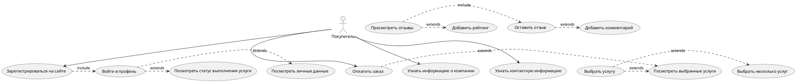
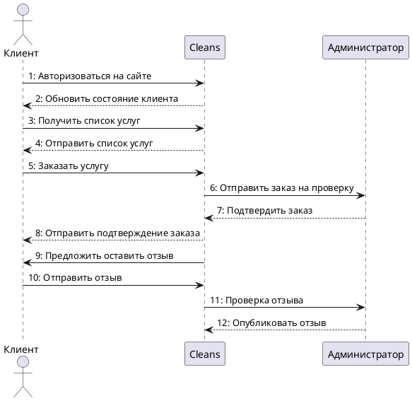
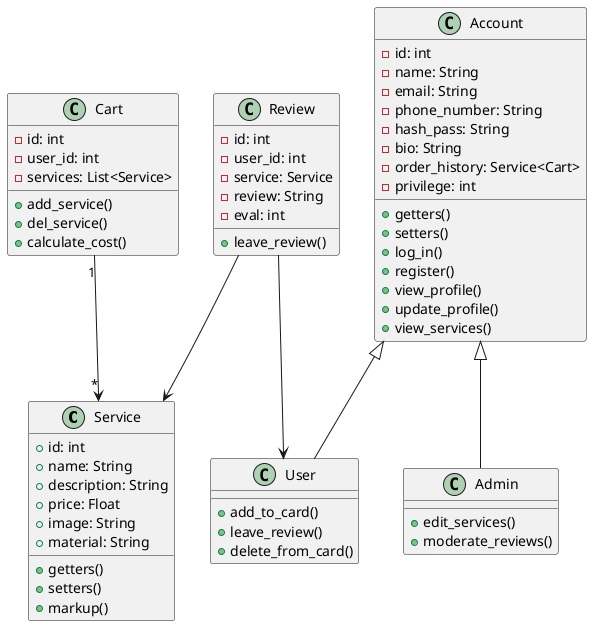

# UML

## Use Case Diagram

```plantuml

@startuml
:Покупатель: --> (Зарегистрироваться на сайте)
(Зарегистрироваться на сайте) .> (Войти в профиль) : include
(Войти в профиль) .> (Посмотреть личные данные) : extends
(Войти в профиль) .> (Посмотреть статус выполнения услуги) : extends
(Просмотреть отзывы) .> (Оставить отзыв) : include
(Оставить отзыв) .> (Добавить комментарий) : extends
(Просмотреть отзывы) .> (Добавить рейтинг) : extends
(Выбрать услугу) .> (Выбрать несколько услуг) : extends
(Выбрать услугу) .> (Посмотреть выбранные услуги) : extends
(Оплатить заказ) .> (Посмотреть выбранные услуги) : extends
:Покупатель: --> (Оплатить заказ)
:Покупатель: --> (Узнать информацию о компании)
:Покупатель: --> (Узнать контактную информацию)
@enduml


```

## Sequence Diagram

```plantuml

@startuml
actor Клиент
participant Cleans
participant Администратор

Клиент -> Cleans : 1: Авторизоваться на сайте
Cleans --> Клиент : 2: Обновить состояние клиента
Клиент -> Cleans : 3: Получить список услуг
Cleans --> Клиент : 4: Отправить список услуг
Клиент -> Cleans : 5: Заказать услугу
Cleans -> Администратор : 6: Отправить заказ на проверку
Администратор --> Cleans : 7: Подтвердить заказ
Cleans --> Клиент : 8: Отправить подтверждение заказа
Cleans -> Клиент : 9: Предложить оставить отзыв
Клиент -> Cleans : 10: Отправить отзыв
Cleans -> Администратор : 11: Проверка отзыва
Администратор --> Cleans : 12: Опубликовать отзыв
@enduml


```

## Class Diagram

```plantuml

@startuml
class Service {
  +id: int
  +name: String
  +description: String
  +price: Float
  +image: String
  +material: String
  +getters()
  +setters()
  +markup()
}

class Cart {
  -id: int
  -user_id: int
  -services: List<Service>
  +add_service()
  +del_service()
  +calculate_cost()
}

class Review {
  -id: int
  -user_id: int
  -service: Service
  -review: String
  -eval: int
  +leave_review()
}

class Account {
  -id: int
  -name: String
  -email: String
  -phone_number: String
  -hash_pass: String
  -bio: String
  -order_history: Service<Cart>
  -privilege: int
  +getters()
  +setters()
  +log_in()
  +register()
  +view_profile()
  +update_profile()
  +view_services()
}

class User {
  +add_to_card()
  +leave_review()
  +delete_from_card()
}

class Admin {
  +edit_services()
  +moderate_reviews()
}

Account <|-- User
Account <|-- Admin
Cart "1" --> "*" Service
Review --> User
Review --> Service
@enduml


```

## ER Diagram

```plantuml

@startuml
class Service {
  +id: int
  +name: String
  +description: String
  +price: Float
  +image: String
  +material: String
  +getters()
  +setters()
  +markup()
}

class Cart {
  -id: int
  -user_id: int
  -services: List<Service>
  +add_service()
  +del_service()
  +calculate_cost()
}

class Review {
  -id: int
  -user_id: int
  -service: Service
  -review: String
  -eval: int
  +leave_review()
}

class Account {
  -id: int
  -name: String
  -email: String
  -phone_number: String
  -hash_pass: String
  -bio: String
  -order_history: Service<Cart>
  -privilege: int
  +getters()
  +setters()
  +log_in()
  +register()
  +view_profile()
  +update_profile()
  +view_services()
}

class User {
  +add_to_card()
  +leave_review()
  +delete_from_card()
}

class Admin {
  +edit_services()
  +moderate_reviews()
}

Account <|-- User
Account <|-- Admin
Cart "1" --> "*" Service
Review --> User
Review --> Service
@enduml


```
